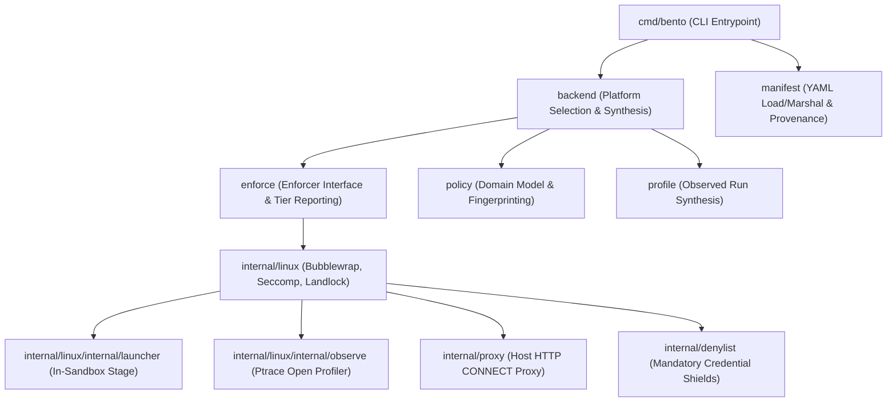
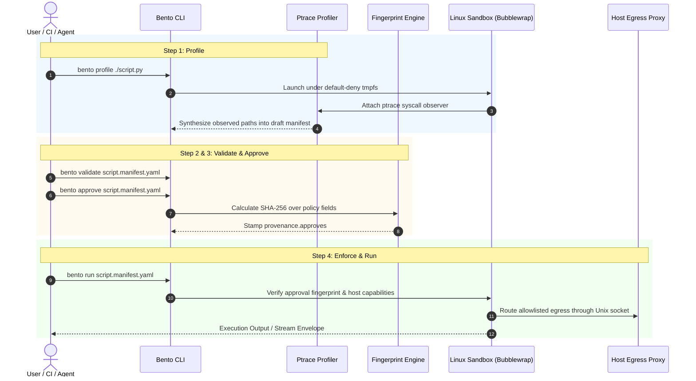
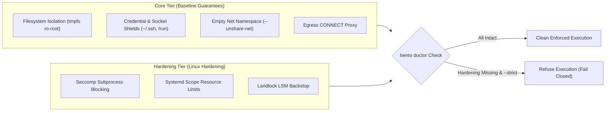

# Bento - Architecture Overview

Bento is a lightweight, fail-closed sandbox for Linux that executes untrusted programs (build scripts, CLI tools, AI agent actions) under strict, manifest-declared permissions.

This document outlines the architecture, package boundaries, execution flows, and enforcement seams of Bento. For threat model details, see [`docs/threat-model.md`](threat-model.md). For historical design decisions, see [`docs/adr/`](adr/).

---

## 1. System Overview

Bento is designed around three core principles:
1. **Machine-Owned Manifests:** Permissions are proposed via profiling, reviewed by humans, and stamped with cryptographic approval fingerprints.
2. **Platform-Decoupled Seams:** Core policy logic, manifest processing, and domain models are decoupled from platform backends (`internal/linux`).
3. **No Silent Degradation:** Host kernel isolation capabilities are reported in explicit tiers. Missing hardening layers surface loudly rather than quietly falling back to a weaker sandbox.

---

## 2. Component Architecture

The codebase is organized into decoupled layers:

### Package Responsibilities

| Package | Purpose |
|---|---|
| `cmd/bento` | CLI subcommands (`profile`, `validate`, `approve`, `run`, `doctor`). |
| `policy` | Platform-independent `Policy` model, path matching, and SHA-256 fingerprinting. |
| `manifest` | Serializes YAML manifests and tracks generation/approval provenance. |
| `enforce` | Core `Enforcer` interface (`Probe` + `Run`), degradation reporting, and capability state matrices. |
| `backend` | Platform backend selector and profiler wrapper. |
| `internal/linux` | Linux bubblewrap backend, seccomp filters, Landlock LSM rules, systemd cgroups, and namespace setup. |
| `internal/proxy` | Shared host-side HTTP CONNECT proxy over isolated Unix domain sockets for network egress control. |
| `internal/denylist` | Platform-independent list of mandatory credential and persistence shields (`~/.ssh`, `.git/hooks`, `/run`). |
| `profile` | Turns a profiling run's observations into a proposed policy for a human to review. |
| `internal/pathresolve` | Resolves a host path the way a write through it lands, including through components that do not exist yet. Shared by `internal/linux` and `profile` so the two cannot disagree about where a grant goes. |

---

## 3. Workflow & Execution Lifecycle

Bento executes in a 4-step lifecycle: **Profile → Validate → Approve → Run**.

---

## 4. Security Tiers & Degradation

Capabilities are structured into **Core** (baseline guarantees) and **Hardening** (platform-specific layers) tiers:

---

## 5. Architectural Decision Records (ADRs)

Detailed technical rationale for core design choices are documented in [`docs/adr/`](adr/):

- [`0001-machine-owned-manifest-workflow.md`](adr/0001-machine-owned-manifest-workflow.md): Machine-owned manifests and fingerprinted approvals.
- [`0002-platform-enforcement-seam-and-tiers.md`](adr/0002-platform-enforcement-seam-and-tiers.md): Decoupled enforcer seam and explicit capability tiers.
- [`0003-host-side-connect-proxy-egress.md`](adr/0003-host-side-connect-proxy-egress.md): Unix domain socket HTTP CONNECT proxy for network egress.
- [`0004-directory-granular-write-grants.md`](adr/0004-directory-granular-write-grants.md): Directory-level write bind mounts for save-via-rename compatibility.
- [`0005-ptrace-open-register-observation.md`](adr/0005-ptrace-open-register-observation.md): Register-level syscall tracing for zero-content profiling.
